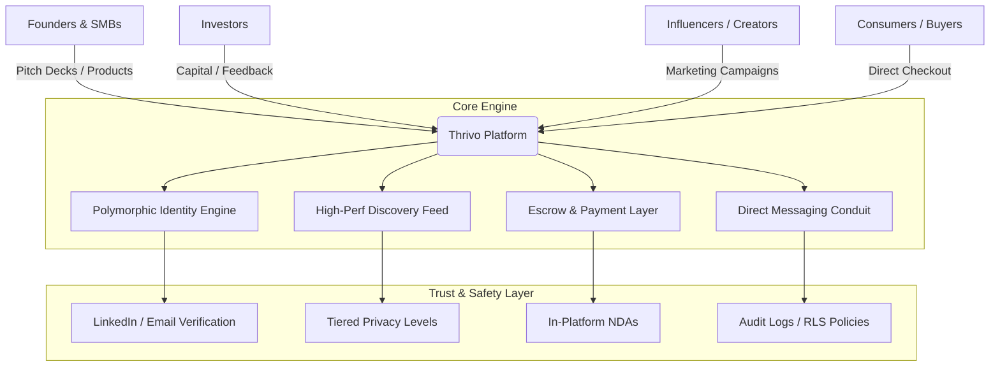

# Thrivo System Documentation

Welcome to the central documentation repository for the **Thrivo Web Application** — a secure, high-trust, multi-sided discovery ecosystem. 

This repository houses all architectural design documents, legal compliance guidelines, user flows, and project roadmaps that define the Thrivo Web Platform.

---

## Mission & Vision

* **Mission:** To democratize and secure the entrepreneurial journey by unifying a highly fragmented startup ecosystem. Thrivo provides small businesses, founders, investors, and creators with a synchronized platform built on verified trust, seamless commerce, and transparent growth metrics.
* **Vision:** To build the world’s most trusted multi-sided discovery ecosystem where any innovative idea can safely transition from a raw founder pitch to a household product without the friction of fragmented platforms, the risk of IP theft, or the barrier of corporate gatekeepers.
* **Core Values:** Uncompromising Trust & Security, Radical Transparency, Zero-Friction Growth, and Inclusivity for Builders.

---

## System Blueprint

---

## Document Directory

This repository is organized into the following sections:

### 1. [Product Specs & Features](./product/)
- **MVP Scope Matrix:** Distinguishing MUST-HAVE security layers from Post-MVP features.
- **User Personas:** Detailed breakdown of Founders, Investors, Creators, and Consumers.
- **Reputation Scoring System:** Specifications of the multi-factor trust-score engine.

### 2. [System Architecture & Database Design](./architecture/)
- **Supabase Row Level Security (RLS) Rules:** Specific Postgres RLS query patterns.
- **Milestone Progress Tracking Ledger:** Relational tables and deal model descriptions.
- **Socket.io Flowcharts:** Real-time bi-directional pipeline architectures.

### 3. [Legal & Compliance (DPDP-Ready)](./compliance/)
- **Data Minimization Guidelines:** What data Thrivo holds, and for how long.
- **Explicit Consent Architectures:** Flow diagrams showing onboarding consent pop-ups.
- **NDA Digital Signature Protocols:** Implementation details for cryptographic timestamp signing of documents.

### 4. [Business & Revenue Models](./business/)
- **Founder Pro Tier:** Pricing structures (₹499–999/month) and premium feature inclusions.
- **Investor Access Plans:** Free basic search, transitioning to post-MVP enterprise CRM sync.
- **Affiliate Smart Contract Framework:** Payment mechanics for creator promotion conversions.

---

## Visual Identity & Brand Personality

* **Brand Personality:** *The Accomplished Catalyst* — Sharp, articulate, supportive, secure, and modern.
* **Design Guidelines:** Modern dark mode interface with smooth gradients, utilizing **Outfit** and **Inter** font systems, emphasizing verified trust badges and clean UI boundaries.